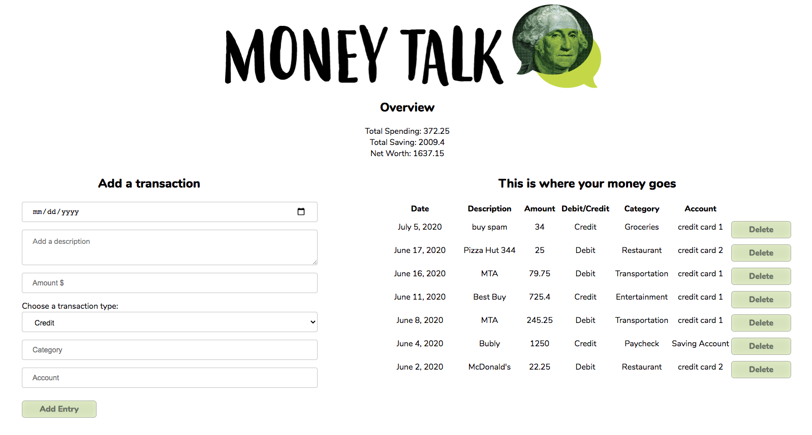

# Money-Talk

> A single page budget / expense tracking application



## Building and running on localhost

First install dependencies:

```sh
npm install
```

To run in hot module reloading mode:

```sh
npm start
```

To create a production build:

```sh
npm run build-prod
```

To create a development build:

```sh
npm run build-dev
```

## Running

Open the file `dist/index.html` or `http://localhost:3000` in your browser

## Contributors

Shelley Chen\
Anna Makagonova
